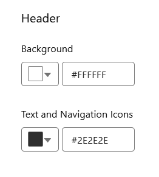
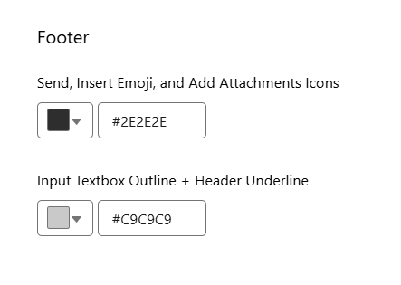
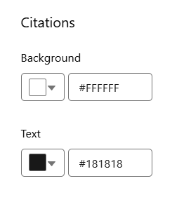
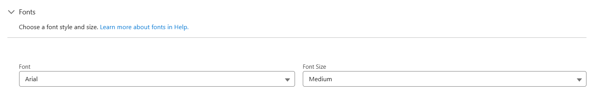
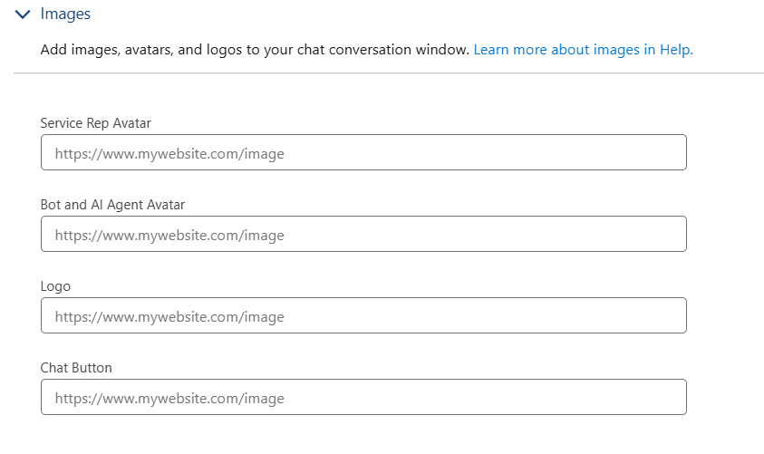
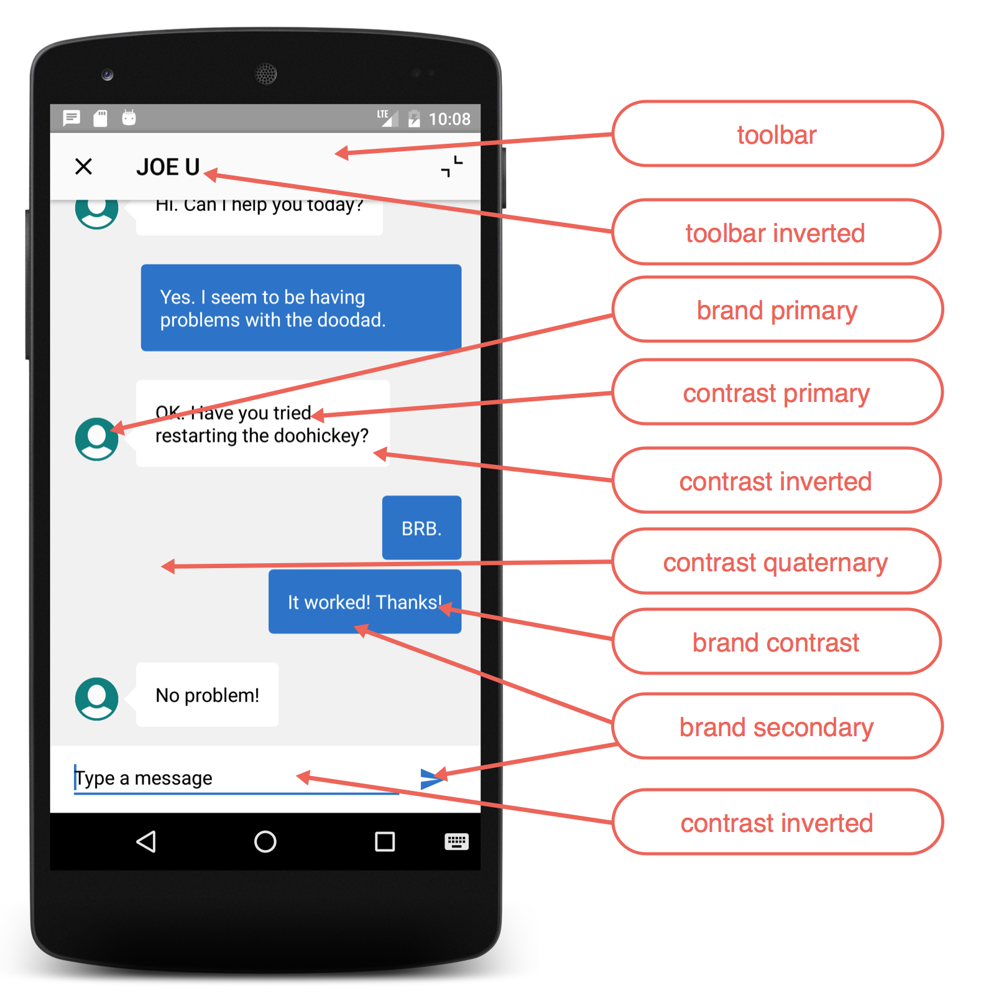

# Einstein Bot — Elementos de Marca (Brand Elements) — WEB e APP

> **Escopo:** Este documento descreve o que pode ser alterado no visual do **Einstein Bot / chat** em duas plataformas:
> - **PARTE 1 — Versão WEB** (Messaging for Web / Embedded Chat) — configurado via Setup, com seletor de cores/fontes/imagens.
> - **PARTE 2 — Versão APP** (Mobile — Service Chat SDK para Android) — configurado por código, sobrescrevendo recursos (`colors.xml` e `Drawables`).
>
> **Fontes:** Salesforce Help — *Brand Elements* (`service.ec_brand_elements_2.htm`); Salesforce Developers — *Customize Colors* e *Customize Images with the Service Chat SDK* (Android).

A ideia dos *Brand Elements* é alinhar a experiência do chat (cores, fontes, ícones e logos) ao tom visual do seu site e da sua marca.

---

# PARTE 1 — Versão WEB (Messaging for Web)

---

## 1. Cores (Color Settings)

As cores podem ser definidas escolhendo no seletor de cores ou digitando o código hexadecimal direto no campo `#`.

### Botão de Chat e Convites (Chat Button and Invitations)
| Elemento | O que controla |
|---|---|
| **Background** | Cor de fundo do botão de chat e do pop-up de convite automático |
| **Text** | Cor do texto do pop-up de convite automático |
| **Dismiss Invitation Button** | Cor do "✕" (fechar) nos pop-ups |

| Configuração | Exemplo |
|---|---|
|  |  |

### Cabeçalho (Header)
| Elemento | O que controla |
|---|---|
| **Background** | Cor de fundo do cabeçalho |
| **Text and Navigation Icons** | Cor do texto do cabeçalho, do botão de minimizar e do ícone de menu |

| Configuração | Exemplo |
|---|---|
|  |  |

### Agente de IA / Bot e Representante (AI Agent and Service Representative)
| Elemento | O que controla |
|---|---|
| **Background** | Fundo das mensagens, avatares e miniaturas iniciais |
| **Text** | Cor do texto do lado do agente de IA / bot |
| **Link** | Cor dos links no lado do agente de IA / bot |

| Configuração | Exemplo |
|---|---|
|  |  |

### Usuário Final (End User)
| Elemento | O que controla |
|---|---|
| **Background** | Fundo das mensagens e miniaturas do usuário final |
| **Text** | Cor do texto do usuário final |
| **Link** | Cor dos links do usuário final |

| Configuração | Exemplo |
|---|---|
|  |  |

### Corpo da Conversa (Conversation Body)
| Elemento | O que controla |
|---|---|
| **Text** | Cor do texto inserido pelo sistema e do corpo das mensagens do usuário |

| Configuração | Exemplo |
|---|---|
|  |  |

### Rodapé (Footer)
| Elemento | O que controla |
|---|---|
| **Icon** | Cor dos ícones de anexo, emoji e enviar |
| **Footer** | Cor da borda do rodapé |

| Configuração | Exemplo |
|---|---|
|  |  |

### Citações (Citations)
| Elemento | O que controla |
|---|---|
| **Background** | Cor de destaque do fundo da seção de título da fonte |
| **Text** | Cor do texto do título do link da fonte citada |

| Configuração | Exemplo |
|---|---|
|  |  |

### Selos e Botões (Badges and Buttons)
| Elemento | O que controla |
|---|---|
| **Badge** | Cor do selo "ir para a mensagem mais recente" |
| **Button** | Cor do botão "Iniciar" e botões semelhantes |

| Configuração | Exemplo |
|---|---|
|  |  |

---

## 2. Fontes (Font Settings)

| Configuração | Opções |
|---|---|
| **Seleção de Fonte** | 13 fontes pré-definidas (Arial, Georgia, Times New Roman, etc.) |
| **Fonte Personalizada** | Subir um *static resource* e informar o nome da família da fonte (font family) |
| **Tamanho da Fonte** | Pequeno (Small), Médio (Medium) ou Grande (Large) |



---

## 3. Imagens (Image Settings)

| Elemento | O que controla |
|---|---|
| **Avatar do Representante (Service Representative Avatar)** | Imagem à esquerda das mensagens do atendente humano |
| **Avatar do Bot / Agente de IA (Bot and AI Agent Avatar)** | Imagem à esquerda das mensagens do bot / agente de IA |
| **Logo** | Logo exibido no cabeçalho do chat (recomendado formato quadrado) |
| **Chat Button** | Imagem exibida no próprio botão de chat |

Também é possível personalizar (em fluxos de pré-chat): imagem de fundo do pré-chat, logo, imagem de estado de espera (*waiting state*) e os avatares/fotos do atendente e do Einstein Bot.



---

## 4. Tamanho da Janela de Chat (Chat Window Size)

| Dimensão | Mínimo | Padrão |
|---|---|---|
| **Largura (Width)** | 80 px | 320 px |
| **Altura (Height)** | 120 px | 480 px |


---

## 5. Personalização Avançada do Cabeçalho (somente Web)

Na versão WEB é possível ir além das opções padrão e customizar o cabeçalho via código:

- **`customHeader.html`** — adiciona os componentes e botões do cabeçalho que serão renderizados na UI.
- **`customHeader.css`** — define o estilo (cores, espaçamento, etc.) desses componentes e botões.

> Isso permite um cabeçalho totalmente sob medida, recurso exclusivo da implementação Web (Enhanced/Lightning Web Components).

---

# PARTE 2 — Versão APP (Mobile — Service Chat SDK para Android)

> Na versão **APP**, a personalização **não é feita pela tela do Setup**. Você sobrescreve recursos dentro do projeto Android:
> - **Cores** → criando valores no arquivo `colors.xml` com os **mesmos nomes de recurso** da tabela abaixo.
> - **Imagens** → sobrescrevendo o `Drawable` com **exatamente o mesmo nome de arquivo** (colocando o arquivo na pasta `res/drawable`).
>
> ⚠️ Para personalizar o **avatar do chatbot** e o **banner do bot**, veja a documentação *Use Einstein Bots with Chat* (configuração específica do bot).

## Mapa visual das áreas editáveis (APP)

A imagem abaixo mostra cada área da tela do chat no app e qual token de cor a controla:



| Área na tela | Token de cor |
|---|---|
| Barra superior (fundo) | `salesforce_toolbar` |
| Ícones/textos da barra superior | `salesforce_toolbar_inverted` |
| Avatar do agente / elementos de marca | `salesforce_brand_primary` |
| Bolha de mensagem do agente (recebida) | `salesforce_contrast_primary` |
| Texto das mensagens | `salesforce_contrast_inverted` |
| Fundo do feed do chat | `salesforce_contrast_quaternary` |
| Texto sobre fundo de marca / bolha do agente | `salesforce_brand_contrast` |
| Bolha de mensagem do usuário (enviada) | `salesforce_brand_secondary` |
| Campo de digitar mensagem / rodapé | `salesforce_contrast_inverted` |

## A. Cores (colors.xml)

Para alterar as cores, crie no `colors.xml` do projeto valores com os mesmos nomes de recurso abaixo. Exemplo:

```xml
<resources>
  <color name="salesforce_brand_primary">#50e3c2</color>
  <color name="salesforce_brand_secondary">#4a90e2</color>
  <color name="salesforce_contrast_inverted">#ffffff</color>
  <color name="salesforce_contrast_primary">#333333</color>
  <color name="salesforce_contrast_secondary">#767676</color>
  <color name="salesforce_feedback_primary">#e74c3c</color>
</resources>
```

### Tokens de branding disponíveis

| Token | Valor padrão | O que controla |
|---|---|---|
| `salesforce_toolbar` | `#FAFAFA` | Cor de fundo da barra superior (toolbar). |
| `salesforce_toolbar_inverted` | `#010101` | Cor do texto e dos ícones da toolbar. |
| `salesforce_brand_primary` | `#007F7F` | Cor de fundo do banner. **Chat:** linha embaixo da mensagem que você está digitando. |
| `salesforce_brand_secondary` | `#2872CC` | **Chat:** bolhas de texto do usuário. |
| `salesforce_brand_contrast` | `#FCFCFC` | Cor do texto de título (*secondary inverted*). |
| `salesforce_contrast_primary` | `#000000` | Cor primária do corpo do texto. |
| `salesforce_contrast_secondary` | `#6D6D6D` | Cor de contraste secundária. |
| `salesforce_contrast_tertiary` | `#BABABA` | Cor de contraste terciária. |
| `salesforce_contrast_quaternary` | `#F1F1F1` | **Chat:** cor de fundo da tela do feed do chat. |
| `salesforce_contrast_inverted` | `#FFFFFF` | Fundo da página, barra de navegação, fundo de células de tabela. **Chat:** cor do botão fechar na visão minimizada; texto das mensagens do cliente; fundo na base da barra de input. |
| `salesforce_feedback_primary` | `#E74C3C` | Cor do texto de mensagens de erro. |
| `salesforce_feedback_secondary` | `#2ECC71` | Cor de feedback secundária (sucesso). |
| `salesforce_feedback_tertiary` | `#F5A623` | Cor de feedback terciária (aviso). |
| `salesforce_title_color` | `#FBFBFB` | Texto em títulos por toda a UI; texto sobre áreas com cor de marca de fundo (*primary inverted*). **Chat:** bolhas de texto do agente. |
| `salesforce_overlay` | `#000000` (40% alpha) | Cor da sobreposição (overlay). |

## B. Imagens (Drawables)

Para trocar uma imagem, sobrescreva o `Drawable` correspondente usando **exatamente o mesmo nome de arquivo**. Ex.: para trocar o avatar do agente, adicione em `res/drawable` um arquivo chamado `salesforce_agent_avatar.xml`.

### Imagens mais comuns (mais usadas)

| Nome do arquivo | O que é | Tamanho |
|---|---|---|
| `chat_ic_footer_menu.xml` | Menu "hambúrguer" na base da janela, ao lado do input do chat. | 48dp × 48dp |
| `chat_ic_minimized_connecting.xml` | Ícone de "conectando" quando a visão está minimizada. | 32dp × 29dp |
| `chat_minimized_message_indicator.xml` | Indicador de mensagem não lida (balão) na visão minimizada. | 27dp × 24dp |
| `common_ic_close.xml` | Botão fechar no canto superior esquerdo da janela. | 24dp × 24dp |
| `salesforce_agent_avatar.xml` | Avatar do agente, ao lado da bolha de mensagem dele. | 36dp × 36dp |
| `salesforce_ic_message_send.xml` | Botão de enviar mensagem, ao lado do input. | 24dp × 24dp |
| `salesforce_ic_minimize.xml` | Botão de minimizar no canto superior direito. | 18dp × 18dp |

### Lista completa de Drawables personalizáveis

<details>
<summary>Clique para ver todos os Drawables da UI do chat</summary>

`chat_button.xml`, `chat_button_pressed.xml`, `chat_footer_menu_item.xml`, `chat_ic_bubble.xml`, `chat_ic_close.xml`, `chat_ic_collapse.xml`, `chat_ic_footer_menu.xml`, `chat_ic_last_photo.xml`, `chat_ic_minimized_connecting.xml`, `chat_ic_photo_gallery.xml`, `chat_menu_bottom_button.xml`, `chat_menu_button.xml`, `chat_menu_header.xml`, `chat_menu_solo_button.xml`, `chat_menu_speech_arrow.xml`, `chat_menu_top_button.xml`, `chat_minimized_message_indicator.xml`, `agent_initial_avatar.xml`, `link_preview_arrow.xml`, `progress_indeterminate_horizontal_material.xml`, `salesforce_agent_avatar.xml`, `salesforce_button.xml`, `salesforce_button_solid.xml`, `salesforce_horizontal_rule.xml`, `salesforce_ic_camera.xml`, `salesforce_ic_message_send.xml`, `salesforce_ic_minimize.xml`, `salesforce_loading_ball.xml`, `salesforce_message_bubble_overlay.xml`, `salesforce_message_bubble_received.xml`, `salesforce_message_bubble_received_speech_arrow.xml`, `salesforce_message_bubble_sent.xml`, `salesforce_minimized_view.xml`, `salesforce_minimized_view_toolbar.xml`, `vector_drawable_progress_indeterminate_horizontal.xml`.

</details>

---

## Resumo rápido — o que dá pra mudar

**WEB (Setup, sem código):**
- **Cores:** botão de chat, convites, cabeçalho, mensagens do bot, mensagens do usuário, links, corpo da conversa, rodapé/ícones, citações, selos e botões.
- **Fontes:** família (13 opções + personalizada) e tamanho.
- **Imagens:** avatar do atendente, avatar do bot/IA, logo do cabeçalho, imagem do botão de chat, imagens de pré-chat/espera.
- **Dimensões:** largura e altura da janela.
- **Cabeçalho (Web):** personalização total via `customHeader.html` + `customHeader.css`.

**APP (Android — via código):**
- **Cores:** 16 tokens de branding no `colors.xml` (`salesforce_toolbar`, `salesforce_brand_primary`, `salesforce_contrast_*`, `salesforce_feedback_*`, etc.).
- **Imagens:** sobrescrever Drawables pelo nome do arquivo (avatar do agente, botão enviar, minimizar, fechar, menu, etc.) — lista completa acima.
- **Avatar/banner do bot:** configurados à parte (*Use Einstein Bots with Chat*).

---

### Observações
- **PARTE 1** refere-se à **versão WEB (Messaging for Web / Embedded Chat)**; **PARTE 2** à **versão APP (Service Chat SDK para Android)**.
- A página da Salesforce Help da versão Web é carregada dinamicamente (JavaScript); o conteúdo foi consolidado a partir da documentação oficial da Salesforce.
- Páginas de referência:
  - WEB: `https://help.salesforce.com/s/articleView?id=service.ec_brand_elements_2.htm&type=5`
  - APP — Cores: `https://developer.salesforce.com/docs/atlas.en-us.noversion.service_sdk_android.meta/service_sdk_android/android_customize_colors.htm`
  - APP — Imagens: `https://developer.salesforce.com/docs/atlas.en-us.noversion.service_sdk_android.meta/service_sdk_android/android_customize_images.htm`
